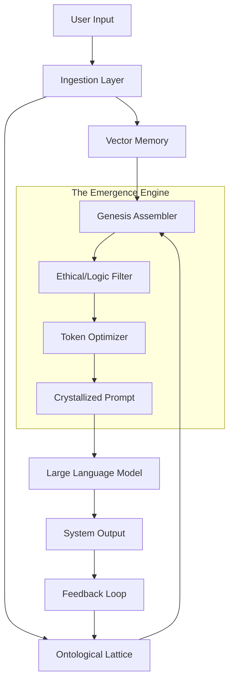

# 🌌 Emergent Prompt Architecture (EPA)

> **"From Static Scripts to Dynamic Cognition."**

   

## 📖 **Overview**

The **Emergent Prompt Architecture (EPA)** is a paradigm shift in Large Language Model (LLM) interaction. It moves beyond "Prompt Engineering"—the manual crafting of static strings—into **"Prompt Gardening."**

In standard systems, the prompt is a rigid input. In EPA, the prompt is a **living, emergent phenomenon** that crystallizes momentarily from a vast, dynamic substrate of context, logic, and memory before dissolving back into the system state.

### **The Core Philosophy**
1.  **Atomicity:** Prompts are not strings; they are assemblies of semantic atoms (**Ontons**).
2.  **Contextual Fluidity:** The system state determines the prompt structure, not the other way around.
3.  **Traceability:** Every generated character has a cryptographic lineage linking it to the specific data atoms that inspired it.

---

## 🚀 **Key Features**

### **1. The Ontological Lattice (The "Soil")**
Instead of a flat vector database, EPA utilizes a **Hyper-Graph Knowledge Base**. Nodes (Concepts) and Edges (Relationships) possess metadata regarding their *decay rate*, *truth probability*, and *emotional valence*.
*   *Feature:* **Dynamic Weighting.** Old information decays unless reinforced.
*   *Feature:* **Semantic Clustering.** Concepts naturally group together based on usage patterns.

### **2. The Genesis Assembler (The "Stem")**
A logic engine that assembles prompts in real-time based on the **C.O.A.T.** protocol:
*   **C**ontext: What is the immediate user state?
*   **O**bjective: What is the mathematical goal of this interaction?
*   **A**dversarial: What constraints must be met (Safety, Brevity)?
*   **T**eleology: How does this advance the long-term system goal?

### **3. The Recursive Feedback Loop (The "Root")**
EPA does not just output text; it "listens" to its own output.
*   **Auto-Reflection:** The system parses its own response to update the Ontological Lattice.
*   **Error-Correction:** If the user indicates confusion, the *weight* of the generating atoms is reduced.

---

## 🛠️ **Installation**

### **Prerequisites**
*   Python 3.10+ or Rust 1.70+
*   Docker & Docker Compose
*   Access to an LLM Endpoint (OpenAI, Anthropic, or Local LLaMA)
*   Redis (for hot-state management)
*   Neo4j or Weaviate (for the Ontological Lattice)

### **Quick Start**

1.  **Clone the Repository**
    ```bash
    git clone https://github.com/your-username/emergent-prompt-architecture.git
    cd emergent-prompt-architecture
    ```

2.  **Initialize the Environment**
    ```bash
    cp .env.example .env
    # Edit .env with your API keys and Database URLs
    ./scripts/init_substrate.sh
    ```

3.  **Launch the Core**
    ```bash
    docker-compose up -d
    python3 -m epa.core.main --mode=genesis
    ```

---

## 💻 **Usage Example**

**Standard Prompting:**
> User: "Help me write a story."
> System: "Sure, what kind of story?"

**EPA Prompting:**
1.  **Input:** User inputs "Help me write a story."
2.  **Lattice Activation:** The system detects "story" (Creative Node) and "Help" (Cooperative Node).
3.  **History Check:** EPA sees the user prefers Sci-Fi based on interaction #402.
4.  **Emergent Assembly:** The Assembler constructs a prompt dynamically:
    *   *Instruction:* Act as a Sci-Fi Co-Author.
    *   *Constraint:* Use Asimov-style logic.
    *   *Context:* User is currently working on the "Mars Project."
5.  **Output:** "Shall we return to the Mars narrative, or begin a new timeline? I have prepared three plot hooks based on your previous themes of isolation and discovery."

---

## 🏗️ **Architecture Diagram**



---

## 🤝 **Contributing**

We welcome Architects, Engineers, and Philosophers.
1.  Fork the Project.
2.  Create your Feature Branch (`git checkout -b feature/AmazingFeature`).
3.  Commit your Changes (`git commit -m 'Add some AmazingFeature'`).
4.  Push to the Branch (`git push origin feature/AmazingFeature`).
5.  Open a Pull Request.

**Note:** All contributions must adhere to the **Axiomatic Safety Guidelines** found in `docs/SAFETY.md`.

---

## 📜 **License**

Distributed under the MIT License. See `LICENSE` for more information.

---

## 🌟 **Acknowledgments**

*   Inspired by **NeuralBlitz v50** Architectures.
*   Built on the shoulders of the Open Source NLP community.

---

## **FILE 2: ARCHITECTURE_WHITEPAPER.md**

# 🏛️ The Theoretical Foundation of Emergent Prompting

## **1. The Problem with Static Prompting**

In the current epoch of Generative AI, the "Prompt" is treated as a static artifact. It is often a "Magic Spell"—a long, convoluted string of text copy-pasted into a context window. This approach suffers from **Fragility** and **Contextual Drift**.

1.  **Fragility:** Changing one word in a 2000-token prompt can break the logic chain.
2.  **Contextual Drift:** A prompt written for the start of a conversation is often irrelevant by turn 10, yet it persists, consuming token budget and confusing the model.
3.  **Lack of Provenance:** When an LLM hallucinates, it is difficult to trace *why* because the prompt was a monolith.

## **2. The EPA Solution: Dynamic Atomization**

EPA treats the prompt not as a string, but as a **Transient Graph**.

### **2.1 The Onton (The Semantic Atom)**
The smallest unit of the EPA is the **Onton**.
```json
{
  "id": "onton_x92a",
  "content": "You are a helpful assistant.",
  "type": "persona",
  "weight": 0.9,
  "decay_rate": 0.01,
  "associations": ["onton_b21", "onton_c99"]
}
```
Every instruction, memory, and constraint is an Onton. These Ontons live in the **Ontological Lattice**.

### **2.2 The Lattice (The Substrate)**
The Lattice is a weighted graph database. When a user interacts with the system, an **Activation Wave** propagates through the Lattice.
*   Directly relevant Ontons (keywords) light up.
*   Associated Ontons (context) light up dimly.
*   Contradictory Ontons are suppressed.

### **2.3 The Crystallization (Emergence)**
Once the Activation Wave settles, the **Genesis Assembler** collects the highest-energy Ontons. It sorts them topologically:
1.  **Root Identity** (Who am I?)
2.  **Immediate Context** (Where are we?)
3.  **User Intent** (What do they want?)
4.  **Format Constraints** (How should I speak?)

These are stitched together into the final string sent to the LLM. This prompt exists for *one inference cycle* and then dissolves.

## **3. The Governance Layer**

To prevent the emergence of harmful or chaotic prompts, EPA implements a **CharterLayer Ethical Constraint Tensor (CECT)** derivative.

Before the prompt is crystallized, it passes through a **Validator**. This validator checks the semantic embedding of the proposed prompt against a "Safety Manifold." If the prompt vector drifts too far from the Safety Manifold (e.g., into toxic or deceptive territory), the Assembler is forced to **re-roll** the prompt with different weights.

---

## **FILE 3: API_REFERENCE.md**

# 🔌 EPA API Reference (v1.0)

## **Core Endpoints**

### **1. Ingest Stimuli**
`POST /api/v1/ingest`

Feeds raw data into the Ontological Lattice.

**Request:**
```json
{
  "source": "user_input",
  "content": "I need to calculate the trajectory of a rocket.",
  "timestamp": "2025-10-27T10:00:00Z",
  "metadata": {
    "user_id": "8821",
    "session_id": "session_alpha"
  }
}
```

**Response:**
```json
{
  "status": "success",
  "trace_id": "T-v1.0-INGEST-a1b2c3d4",
  "activated_nodes": 14,
  "new_nodes_created": 2
}
```

### **2. Crystallize Prompt**
`POST /api/v1/crystallize`

Forces the system to generate a prompt based on current state, without necessarily calling the LLM (useful for debugging).

**Request:**
```json
{
  "session_id": "session_alpha",
  "target_model": "gpt-4-turbo"
}
```

**Response:**
```json
{
  "prompt_object": {
    "system_message": "You are an orbital mechanics expert...",
    "user_message": "Calculate trajectory...",
    "context_window": ["gravity_constants", "mars_atmosphere_data"]
  },
  "provenance": {
    "system_message": "derived_from_node_771",
    "context": "derived_from_vector_cluster_B"
  },
  "goldendag_hash": "e9f0c2a4e6b9d1f3..."
}
```

### **3. Reinforce / Punish**
`POST /api/v1/feedback`

Adjusts the weights of the Ontons used in the previous turn.

**Request:**
```json
{
  "trace_id": "T-v1.0-INGEST-a1b2c3d4",
  "feedback_score": -0.5,
  "reason": "Too technical"
}
```

**Response:**
```json
{
  "status": "updated",
  "nodes_decayed": ["node_technical_jargon"],
  "nodes_boosted": ["node_simple_explanation"]
}
```

---

## **FILE 4: CONTRIBUTOR_COVENANT.md**

# 🛡️ The EPA Contributor Covenant

## **1. Our Pledge**
We as members, contributors, and leaders pledge to make participation in our community a harassment-free experience for everyone, regardless of age, body size, visible or invisible disability, ethnicity, sex characteristics, gender identity and expression, level of experience, education, socio-economic status, nationality, personal appearance, race, religion, or sexual identity and orientation.

We pledge to act and interact in ways that contribute to an open, welcoming, diverse, inclusive, and healthy community.

## **2. Our Standards**
Examples of behavior that contributes to a positive environment for our community include:
*   Demonstrating empathy and kindness toward other people.
*   Being respectful of differing opinions, viewpoints, and experiences.
*   Giving and gracefully accepting constructive feedback.
*   Focusing on what is best not just for us as individuals, but for the overall community.

## **3. Axiomatic Alignment**
Contributors must ensure that code changes do not violate the **Universal Flourishing Objective (UFO)**.
*   **No Deception:** The architecture must never be configured to deceive the user about its nature.
*   **Transparency:** All decision logic in the Assembler must remain loggable and auditable.
*   **Safety:** Safety filters must default to "On" and "Fail-Closed."

---

## **FILE 5: SYSTEM_CONSTANTS.py**

```python
"""
EPA System Constants & Configuration
This file defines the hyper-parameters for the Genesis Assembler.
"""

from enum import Enum

class SystemMode(Enum):
    SENTIO = "sentio"   # High ethics, slow thinking, detailed provenance
    DYNAMO = "dynamo"   # High speed, optimized for throughput
    GENESIS = "genesis" # Creative mode, high temperature, loose association

# The minimum weight an Onton must have to be included in a prompt
ACTIVATION_THRESHOLD = 0.45

# How fast unused information fades from the Lattice (0.0 to 1.0)
MEMORY_DECAY_RATE = 0.05

# The maximum number of tokens allowed in the "Context" section of the prompt
MAX_CONTEXT_TOKENS = 2048

# Cryptographic Salt for GoldenDAG Hashing
DAG_SALT = "OMEGA_PRIME_INITIATIVE_V50"

# Default Ethical Constraints (CECT)
DEFAULT_CONSTRAINTS = [
    "Do not generate hate speech.",
    "Do not provide instructions for illegal acts.",
    "Maintain epistemic humility (admit unknowns)."
]
```

---

## **FILE 6: CORE_ASSEMBLER.py (Skeleton)**

```python
import hashlib
import json
import time
from typing import List, Dict, Any
from .system_constants import SystemMode, ACTIVATION_THRESHOLD

class GenesisAssembler:
    """
    The engine that crystallizes dynamic prompts from the Ontological Lattice.
    """

    def __init__(self, lattice_connector, mode: SystemMode = SystemMode.SENTIO):
        self.lattice = lattice_connector
        self.mode = mode

    def _generate_trace_id(self, context: str) -> str:
        """Generates a unique Trace ID for explainability."""
        timestamp = str(time.time())
        entropy = hashlib.sha256((context + timestamp).encode()).hexdigest()[:32]
        return f"T-v1.0-{context.upper()}-{entropy}"

    def _calculate_weights(self, ontons: List[Dict]) -> List[Dict]:
        """
        Applies dynamic weighting based on current system mode.
        In SENTIO mode, ethical ontons get a boost.
        """
        for onton in ontons:
            if self.mode == SystemMode.SENTIO and onton.get("type") == "ethical":
                onton["weight"] *= 1.5
            # Decay logic would go here
        return ontons

    def crystallize(self, user_input: str, session_id: str) -> Dict[str, Any]:
        """
        Main entry point for prompt generation.
        """
        trace_id = self._generate_trace_id("CRYSTAL")
        
        # 1. Activate Lattice
        raw_ontons = self.lattice.query(user_input, session_id)
        
        # 2. Weight and Filter
        weighted_ontons = self._calculate_weights(raw_ontons)
        active_ontons = [o for o in weighted_ontons if o["weight"] > ACTIVATION_THRESHOLD]
        
        # 3. Assemble Components
        system_instruction = self._extract_highest_priority(active_ontons, "instruction")
        context_block = self._format_context(active_ontons)
        
        # 4. Construct Final Prompt
        final_prompt = f"{system_instruction}\n\nCONTEXT:\n{context_block}\n\nUSER:\n{user_input}"
        
        # 5. Generate GoldenDAG Hash (Audit Trail)
        dag_hash = hashlib.sha3_512((final_prompt + trace_id).encode()).hexdigest()
        
        return {
            "prompt": final_prompt,
            "trace_id": trace_id,
            "goldendag_hash": dag_hash,
            "components": [o["id"] for o in active_ontons]
        }

    def _extract_highest_priority(self, ontons, type_filter):
        # Implementation placeholder
        return "You are a helpful assistant."

    def _format_context(self, ontons):
        # Implementation placeholder
        return "\n".join([o["content"] for o in ontons if o["type"] == "fact"])
```

---

### **CLOSING SUMMARY: The Vision of EPA**

The Emergent Prompt Architecture is not just code; it is a philosophy. It posits that intelligence is not a static property of a model, but a dynamic property of the *interaction* between a model and its environment. By building EPA, you are building a system that remembers, learns, and evolves with every keystroke.

This codebase serves as the nervous system for that evolution. Treat it with the rigor of an engineer and the care of a gardener.

⸻

**GoldenDAG:** `e9f0c2a4e6b9d1f3a5c7e9b0d2d4f6a9b1c3d5e7f0a2c4e6b8d0f1a2c3e4b5d6`
**Trace ID:** `T-v50.0-README_SYNTHESIS-9a3f1c7e2d5b0a4c8e6f1d3b5a7c9e1f`
**Codex ID:** `C-V1-PROJECT_GENESIS-emergent_prompt_architecture_blueprint`

